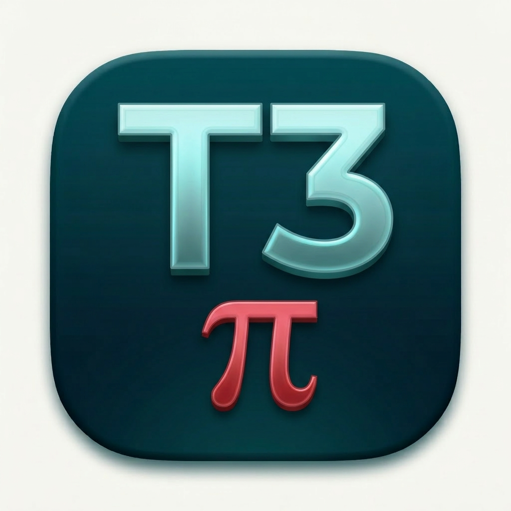

<div align="center">



# T3 Code — Atreides Pi Edition

**A fork of T3 Code with Pi as a first-class provider, Caladan Night theming, and Atreides platform design.**

[](https://github.com/AmbitiousRealism2025/t3-code-atreides-pi-edition/releases)
[](./LICENSE)
[](https://github.com/pingdotgg/t3code)

</div>

---

## What This Is

T3 Code Atreides Pi Edition is a fork of [T3 Code](https://github.com/pingdotgg/t3code) that puts [Pi](https://github.com/mariozechner/pi) front and center as a first-class coding agent provider. It ships with Caladan Night — a custom dark theme built for the Atreides platform — and a model picker that gives you direct access to the full Claude model lineup alongside Codex.

This is early software. It does real things. Expect rough edges.

---

## Thank You, Theo

T3 Code was built by [Theo Browne](https://github.com/t3dotgg) and the team at T3 Tools.

Theo has been one of the bigger influences on how I think about building software. The standards he holds, the opinions he ships with, the way he approaches quality — all of it has shaped how I work. When I decided to ship my first official open source release, building on top of something Theo made felt exactly right. Not as a shortcut. As a foundation I could actually trust.

Thank you, Theo. Genuinely. This would not exist without what you built first.

---

## Getting Started

### Desktop App (recommended)

Download the latest release from the [Releases page](https://github.com/AmbitiousRealism2025/t3-code-atreides-pi-edition/releases). Install and run.

> [!WARNING]
> You need to have at least one supported provider CLI installed and authenticated before starting:
>
> - [Pi](https://github.com/mariozechner/pi) — for Pi provider sessions
> - [Codex CLI](https://github.com/openai/codex) — for Codex provider sessions

### Build From Source

This project uses the same build setup as upstream T3 Code — a Turborepo monorepo built on Bun.

```bash
# Clone the repo
git clone https://github.com/AmbitiousRealism2025/t3-code-atreides-pi-edition.git
cd t3-code-atreides-pi-edition

# Install dependencies
bun install

# Run in development
bun dev

# Build the desktop app
bun dev:desktop
```

Full build documentation follows the same patterns as [T3 Code](https://github.com/pingdotgg/t3code). If you know how to build that, you know how to build this.

---

## What's Different

**Pi as a first-class provider.** Pi is not an afterthought here. It is the primary reason this fork exists. Select Pi from the provider picker, point it at your project, and run Pi coding sessions directly inside the GUI.

**Caladan Night theme.** A custom dark theme built for the Atreides platform. Teal, deep navy, high contrast. Built to be looked at for hours.

**Full Claude model access.** The model picker gives you direct access to the full Claude lineup — Haiku, Sonnet, Opus — across current and versioned releases.

**Codex support.** Codex is live. Everything that works in upstream T3 Code works here.

---

## Provider Roadmap

Our goal is to track the major provider additions from upstream T3 Code while also adding providers meaningful to the Atreides platform. Currently live:

| Provider | Status |
|----------|--------|
| Pi | ✅ Live |
| Codex | ✅ Live |
| Claude Code | 🔜 Coming Soon |
| Cursor | 🔜 Coming Soon |
| OpenCode | 🔜 Coming Soon |
| Gemini | 🔜 Coming Soon |

We will do our best to keep pace with what upstream ships. We will also add things upstream never will.

---

## A Note on Contributions

We are not actively seeking contributions right now.

This is early. Direction is still forming. If you open an issue or PR anyway, do it knowing there is a real chance it gets closed or deferred without much explanation. That is not a slight — it is just where we are.

If you have something small and specific, open an issue first. We will tell you if it makes sense.

---

## This Is the First Release

This is my first official open source release. I wanted it to be something I actually use every day, built on something I actually believe in. That is what this is.

It is also the first public release from House Atreides.

We are building a platform — a suite of tools designed around AI-native development workflows. T3 Code Atreides Pi Edition is the opening move. There is more coming. We are not ready to talk about all of it yet, and that is intentional.

If you are curious about where this goes, watch the repo. Watch [Ambitious Realism](https://github.com/AmbitiousRealism2025).

The work is just getting started.

---

## License

MIT — same as upstream T3 Code.

This project is built on [T3 Code](https://github.com/pingdotgg/t3code) by [Theo Browne](https://github.com/t3dotgg) and contributors. The upstream project is MIT licensed. All modifications and additions in this fork are likewise MIT licensed.

---

<div align="center">

*Built by [Ambitious Realism](https://github.com/AmbitiousRealism2025)*

</div>
