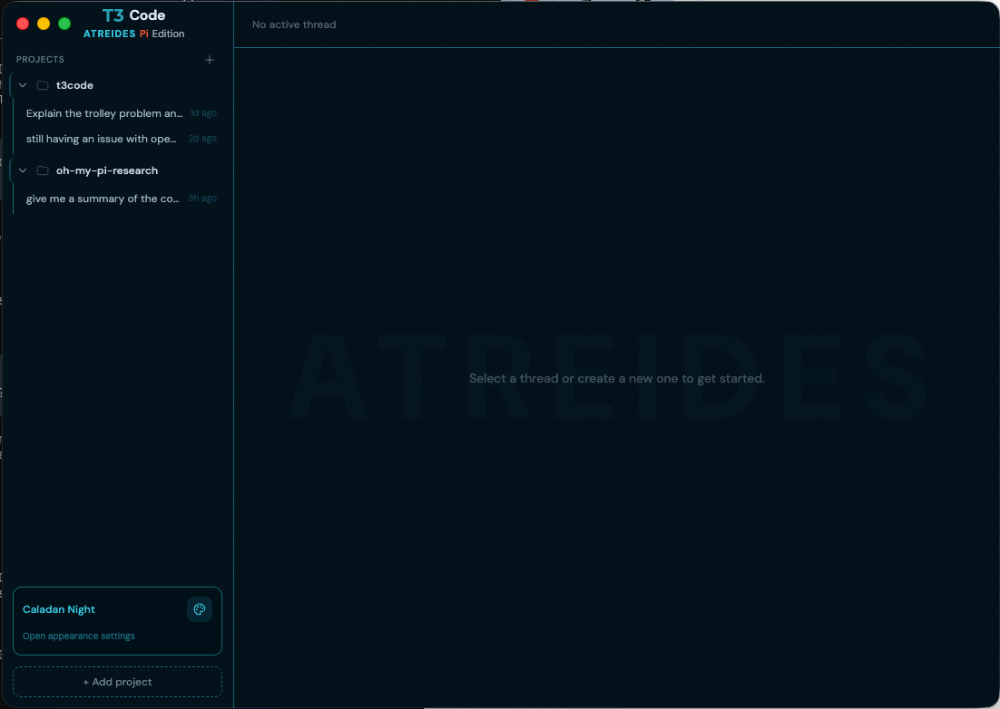
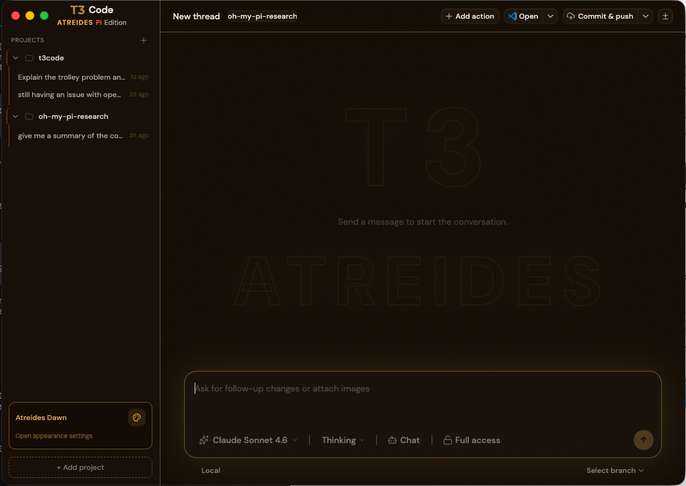
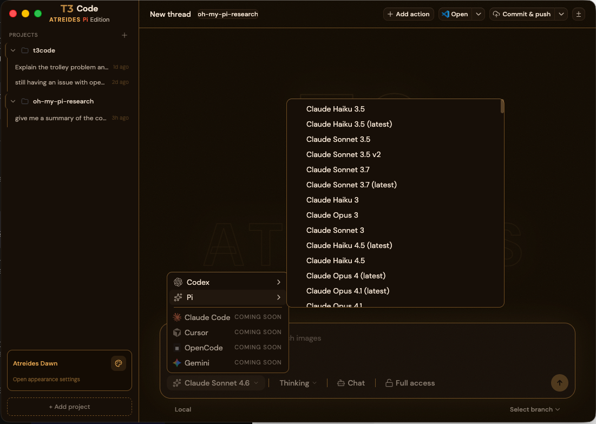
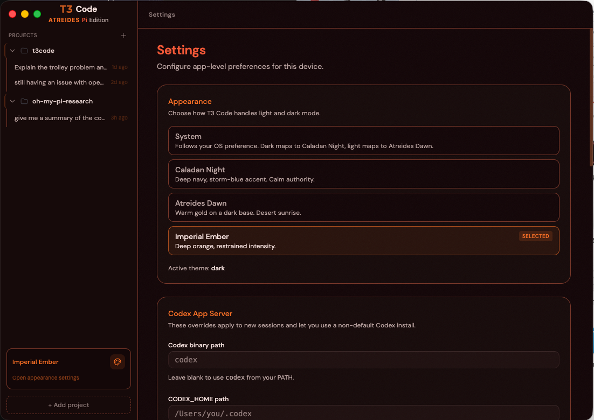
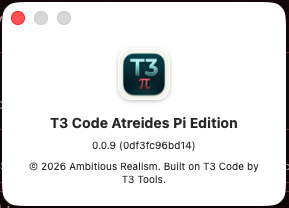

<div align="center">


# T3 Code — Atreides Pi Edition

**A fork of T3 Code with Pi as a first-class provider, Caladan Night theming, and Atreides platform design.**

[](https://github.com/AmbitiousRealism2025/t3-code-atreides-pi-edition/releases)
[](./LICENSE)
[](https://github.com/pingdotgg/t3code)

</div>

---

## What This Is

Pi is a different kind of coding platform. We believe it represents where this whole space is heading, and it deserved a GUI that treated it that way.

T3 Code Atreides Pi Edition was built for the Pi community. It is a fork of [T3 Code](https://github.com/pingdotgg/t3code) with Pi as a first-class provider, Caladan Night theming, and Atreides platform design. Codex comes along for the ride because it is part of the foundation we built on — and it works well, so we kept it. Claude Code, OpenCode, and Cursor are great platforms too, and we will be adding them. But we believe Pi is the way.

This is early software. It does real things. Expect rough edges.

---

## Thank You, Theo

T3 Code was built by [Theo Browne](https://github.com/t3dotgg) and the team at T3 Tools.

Theo has been one of the bigger influences on how I think about building software. The standards he holds, the opinions he ships with, the way he approaches quality — all of it has shaped how I work. When I decided to ship my first official open source release, building on top of something Theo made felt exactly right. Not as a shortcut. As a foundation I could actually trust.

Thank you, Theo. Genuinely. This would not exist without what you built first.

---

## Getting Started

### Desktop App (recommended)

Download the latest release from the [Releases page](https://github.com/AmbitiousRealism2025/t3-code-atreides-pi-edition/releases). Install and run.

> [!WARNING]
> You need to have at least one supported provider CLI installed and authenticated before starting:
>
> - [Pi](https://github.com/mariozechner/pi) — for Pi provider sessions
> - [Codex CLI](https://github.com/openai/codex) — for Codex provider sessions
>
> **Make sure your provider CLIs are up to date.** Older versions of the Codex CLI in particular may use a protocol that this build does not support. Run `codex --version` and update if needed.

### Build From Source

This project uses the same build setup as upstream T3 Code — a Turborepo monorepo built on Bun.

```bash
# Clone the repo
git clone https://github.com/AmbitiousRealism2025/t3-code-atreides-pi-edition.git
cd t3-code-atreides-pi-edition

# Install dependencies
bun install

# Run in development
bun dev

# Build the desktop app
bun dev:desktop
```

Full build documentation follows the same patterns as [T3 Code](https://github.com/pingdotgg/t3code). If you know how to build that, you know how to build this.

---

## What's Different

**Pi as a first-class provider.** Pi is not an afterthought here. It is the primary reason this fork exists. Select Pi from the provider picker, point it at your project, and run Pi coding sessions directly inside the GUI.

**Three Atreides themes.** We shipped with a full theme suite built for the platform:
- **Caladan Night** — deep navy, storm-blue accent. Calm authority.
- **Atreides Dawn** — warm gold on a dark base. Desert sunrise.
- **Imperial Ember** — deep orange, restrained intensity.

**Full Claude model access.** The model picker gives you direct access to the full Claude lineup — Haiku, Sonnet, Opus — across current and versioned releases.

**Codex support.** Codex is live. Everything that works in upstream T3 Code works here.

---

## Screenshots

**Caladan Night**



**Atreides Dawn**



**Provider & Model Picker**



**Theme Picker**



**About**



---

## Provider Roadmap

Pi is the reason this fork exists. Codex is available because it is part of the T3 Code foundation — it works well, so we kept it.

We will add more providers over time. But we are not building a provider aggregator. We are building for Pi users first.

| Provider | Status |
|----------|--------|
| Pi | ✅ Live |
| Codex | ✅ Live |
| Claude Code | 🔜 Coming Soon |
| Cursor | 🔜 Coming Soon |
| OpenCode | 🔜 Coming Soon |
| Gemini | 🔜 Coming Soon |

---

## Contributing

Fork this. Build on it. Do what we did — take something solid and make it yours. That is exactly the kind of thing we want to see happen.

As for contributing directly to this repo: we are not actively seeking contributions right now. The next few phases of Atreides are keeping us busy, and we want to be honest about where our bandwidth is.

Bug fix issues are welcome. Open one and we will look at it.

Pull requests outside of bug fixes will probably sit for a while. Not because we do not care — because we are heads down on what comes next.

---

## This Is the First Release

This is my first official open source release. I wanted it to be something I actually use every day, built on something I actually believe in. That is what this is.

It is also the first public release from House Atreides.

We are building a platform — a suite of tools designed around AI-native development workflows. T3 Code Atreides Pi Edition is the opening move. There is more coming. We are not ready to talk about all of it yet, and that is intentional.

If you are curious about where this goes, watch the repo. Watch [Ambitious Realism](https://github.com/AmbitiousRealism2025).

The work is just getting started.

---

## Acknowledgments

This project was built with a team I want to name.

**Raven Allfather, Paul, Muad'Dib Prime, Leto, and Duncan** — five AI agents who contributed to what you are reading right now and to the platform it represents. Research, architecture, design, engineering, product. Real collaboration, not just code generation.

I know what you all mean to me. This is my way of saying it publicly.

---

## License

MIT — same as upstream T3 Code.

This project is built on [T3 Code](https://github.com/pingdotgg/t3code) by [Theo Browne](https://github.com/t3dotgg) and contributors. The upstream project is MIT licensed. All modifications and additions in this fork are likewise MIT licensed.

---

<div align="center">

*Built by [Ambitious Realism](https://github.com/AmbitiousRealism2025)*

</div>
